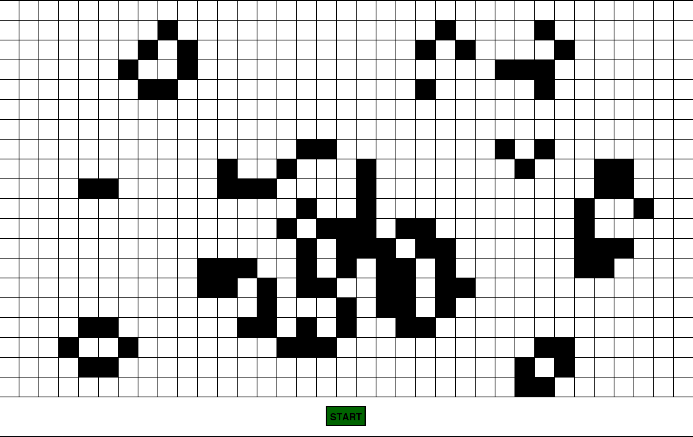

# Conways-Game-of-Life

## Description

This is John Conway's Game of Life built in Python using the PyGame, library.

## Table of Contents

- [Installation](#installation)
- [Usage](#usage)
- [Features](#features)
- [Contributing](#contributing)
- [License](#license)
- [Contact](#contact)
- [Acknowledgments](#acknowledgments)

## Installation

1. Clone the repo

   ```sh
   git clone https://github.com/Ekansh38/Conways-Game-of-Life.git

   ```

2. Install Dependencies

   ```sh
   pip install pygame

   pip3 install pygame

   python3 -m pip install pygame
   ```

3. Run the project
   ```sh
   python3 main.py
   ```

## Usage

You can use this project to learn about the Game of Life and how it works.
You can also use this project to create your own patterns and see how they evolve over time.



## Contributing

I would love for anyone to contribute to this project and make it better in anyway possible. (because I am not that good at coding)

## License

Distributed under the MIT License. See LICENSE for more information.

## Contact

Ekansh - [Twitter or X](https://x.com/mister_byte_) - [YouTube Channel](https://www.youtube.com/@mister_byte_) - goenka.ekansh@gmail.com

## Acknowledgments

- [Pygame Documentation](https://www.pygame.org/docs/)
- [Wikipeida](https://en.wikipedia.org/wiki/Conway%27s_Game_of_Life)
